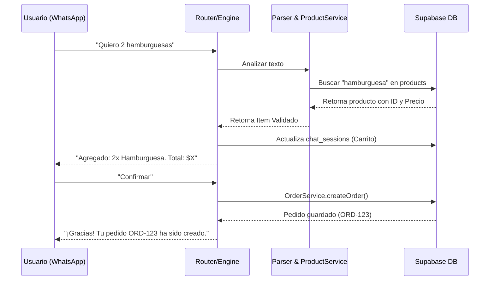

# Documentación Técnica: Sistema de Pedidos WhatsApp

Este documento detalla la arquitectura de datos y el flujo de funciones principales para la gestión de pedidos a través del bot.

## 1. Estructura de la Base de Datos (Supabase)

El sistema de pedidos interactúa principalmente con las siguientes tablas:

### Tabla: `products`
Almacena el catálogo de productos disponibles.
- `id`: UUID (Primary Key)
- `name`: Nombre del producto (ej: "Hamburguesa Simple")
- `price`: Precio unitario (Decimal)
- `stock`: Cantidad disponible (Integer)
- `category`: Categoría (ej: "Comida", "Bebida")

### Tabla: `orders`
Cabecera del pedido.
- `id`: UUID (Primary Key)
- `client_id`: Referencia al cliente (UUID)
- `channel`: Origen (`'WHATSAPP'`, `'WEB'`, etc.)
- `status`: Estado (`'PENDING'`, `'CONFIRMED'`, `'DELIVERED'`)
- `total_amount`: Suma total del pedido
- `delivery_date`: Fecha de entrega programada

### Tabla: `order_items`
Detalle de cada producto dentro de un pedido.
- `id`: UUID (Primary Key)
- `order_id`: Referencia al pedido (Foreign Key)
- `product_id`: Referencia al producto (Foreign Key)
- `quantity`: Cantidad solicitada
- `unit_price`: Precio del producto al momento de la compra (snapshot)

### Tabla: `chat_sessions`
Mantiene el estado de la conversación y el "carrito" temporal.
- `phone`: Número de teléfono (Primary Key)
- `step`: Paso actual del flujo (ej: `'welcome'`, `'order'`, `'confirm'`)
- `temp_data`: JSON que guarda los items del carrito antes de confirmar

---

## 2. Funciones y Servicios Principales

### A. Parser de Mensajes (`Parser.js`)
Es el encargado de "entender" lo que el usuario escribe.
- **Función**: `parse(text)`
- **Lógica**: Utiliza expresiones regulares para detectar patrones como `"2 pizzas"` o `"un lomo de ternera"`. Normaliza el texto (quita acentos y convierte a minúsculas) y devuelve una lista de objetos `{ qty, product }`.

### B. Búsqueda Difusa (`ProductService.js`)
Como el usuario puede escribir mal el nombre de un producto, el bot usa lógica difusa.
- **Función**: `findProduct(searchTerm)`
- **Lógica**: Compara lo que el usuario escribió con todos los nombres de la tabla `products`. Calcula un "puntaje" basado en la distancia de Levenshtein y la coincidencia de palabras. Si el puntaje es mayor a 0.4, considera que es un "match".

### C. Motor de Flujos (`FlowEngine.ts`)
Orquesta la progresión de la charla.
- **Función**: `processMessage(phone, text)`
- **Lógica**:
  1. Recupera la sesión del usuario.
  2. Si no hay sesión, busca un flujo (como "hola" o "pedir").
  3. Si ya está en un flujo (ej: pidiendo), delega el texto al flujo correspondiente para que actualice el carrito en `temp_data`.

### D. Creación de Pedido (`OrderService.ts`)
Impacta la base de datos real.
- **Función**: `createOrder(userId, items)`
- **Lógica**:
  1. Inicia una transacción.
  2. Inserta un registro en `orders` con el total calculado.
  3. Mapea todos los items del carrito e inserta múltiples registros en `order_items`.
  4. (Opcionalmente) Descuenta el stock de la tabla `products`.

---

## 3. Flujo Visual del Pedido

